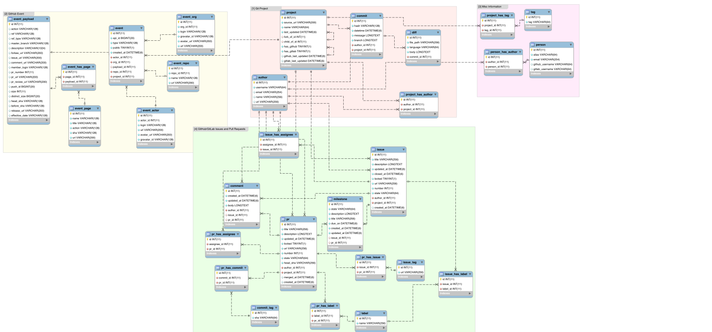

# Database Information

## Entity Relation Diagram



#### Description of Table Families
1) Git Project
    * The tables in this section pertain to the storing of Git commits, diffs, and authors. The `project` table can be seen as the root table of the entire IDEAS database. 
2) GitHub Event
    * This table family is associated with the storing of [GitHub events](https://docs.github.com/en/developers/webhooks-and-events/events/github-event-types). Unlike the other API dependent information (issues, pull requests, comments, etc.), GitHub events are fetched using the [GitHub REST API](https://docs.github.com/en/rest).
3) Misc Information
    * The Misc Information table family is for tables that do not belong to other families. Currently, these tables store project tags, simple strings that we can add to any project, and person information. The person information tables arefor collating authors, whom may have multiple logins, emails, etc. to a singular entity.
4) GitHub/GitLab Issues and Pull Requests
    * The tables in this family contain information associated with pull requests, issues, comments, milestones, etc. from GitHub and GitLab. These are fetched using the [GitHub GraphQL API](https://docs.github.com/en/graphql) and the [GitLab GraphQL API](https://docs.gitlab.com/ee/api/graphql/) which out perform their REST API counterparts. The queries can be seen in `src/gitutils/graphql_queries.py`.

*For further information, see the `models.py` file in the `database/` directory on the `sansa` django path.*

## Directory Structure                   

| Name          | Description                                                         |
| ------------  | ------------------------------------------------------------------- | 
| `examples/`   | Tutorial notebooks on how to access the database.                   |
| `resources/`  | ER diagrams, website description blurbs, and similar files.         |

## Interface Usage

Command line script for updating and adding new projects to the database. This script should be used by just the admins and users should look at the `examples/` on how to access the data. Must be run in the `ideas-uo/` (top level) directory. By default the `--host`, `--port`, and `--database` flags are set to the `sansa` MySQL IDEAS database.

#### Adding/updating a Git project:
```bash
python3 -m src.gitutils.db_interface --username USERNAME --password PASSWORD --add_project PROJECT_URL
```

#### Adding/updating GitHub events for a Git project:
```bash
python3 -m src.gitutils.db_inteface --username USERNAME --password PASSWORD --add_events PROJECT_URL
```

#### Adding/updating GitHub/GitLab pull requests for a Git project:
```bash
python3 -m src.gitutils.db_interface --username USERNAME --password PASSWORD --add_prs PROJECT_URL
```

#### Adding/updating GitHub/GitLab issues for a Git project:
```bash
python3 -m src.gitutils.db_interface --username USERNAME --password PASSWORD --add_issues PROJECT_URL
```

#### Debugging and special flags:

* To check for commits from the beginning use the `--force_epoch` flag.
* To keep repo folders on disk after the script use `--keep_repos`.
* Don't fetch branch info for commits use `--no_branches` (DO THIS FOR DEBUGGING AS FETCHING BRANCHES IS A VERY EXPENSIVE TASK).
* To change the interval of uploads use the `--since` and `--until` flags. Both take in ISO8601 datetime strings (might work with YYYY-MM-DD format).
* To add tags to a project use the `--tags TAG [TAG ...]` flag when using the `--add_project` command.
* To indicate that a project is a fork of another project use `--fork_of URL` where `URL` is the Git url of the existing project. 
* To indicate that a project is a child of antoher project use `--child_of URL`. See above.

## Django/MySQL Notable Changes

| Source File               | Change                                                               |
| ------------------------- | ------------------------------------------------------------------------------------------------------------------------------------------- |
| `IDEAS/IDEAS/settings.py` | Add `'database'` to `INSTALLED_APPS`. Connects database application to the project. Does not automatically occur when running `migrate.py`. |
| `IDEAS/IDEAS/settings.py` | May want to change `SECRET_KEY` once closer to use.                                                                                         |
| `IDEAS/IDEAS/settings.py` | Under `DATABASE` set `options` to include: `charset: utf8mb4` and `use_unicode: True`.                                                      |
| `MySQL Tables & Database` | Need to alter database and tables to collate to `utf8mb4` charset.                                                                          |
